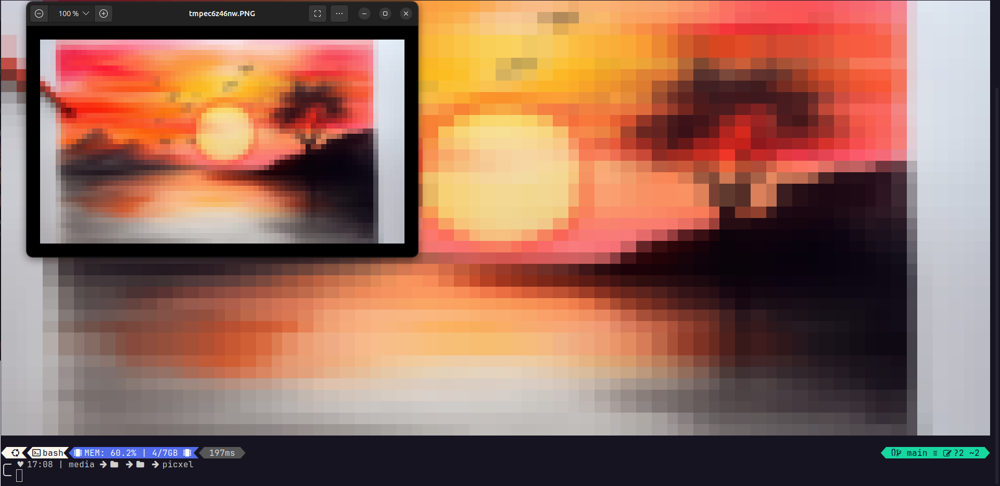

# Picxel

Script en python que permite la conversion de cualquier imagen a formato pixelart, tanto en formato de imagenes (png, jpg, etc) como en formato ascii en la terminal



## Requisitos

- Python 3.8 o superior
- PIL (Pillow)
- tkinter

## Instalación

```bash
# clonar el repositorio

git clone https://github.com/jorge-marco5/picxel.git

# instalar dependencias

cd picxel
pip install -r requirements.txt

# activar entorno virtual

python3 -m venv venv

# en windows
venv\Scripts\activate

# en linux
source venv/bin/activate

# ejecutar

python src/main.py
```
